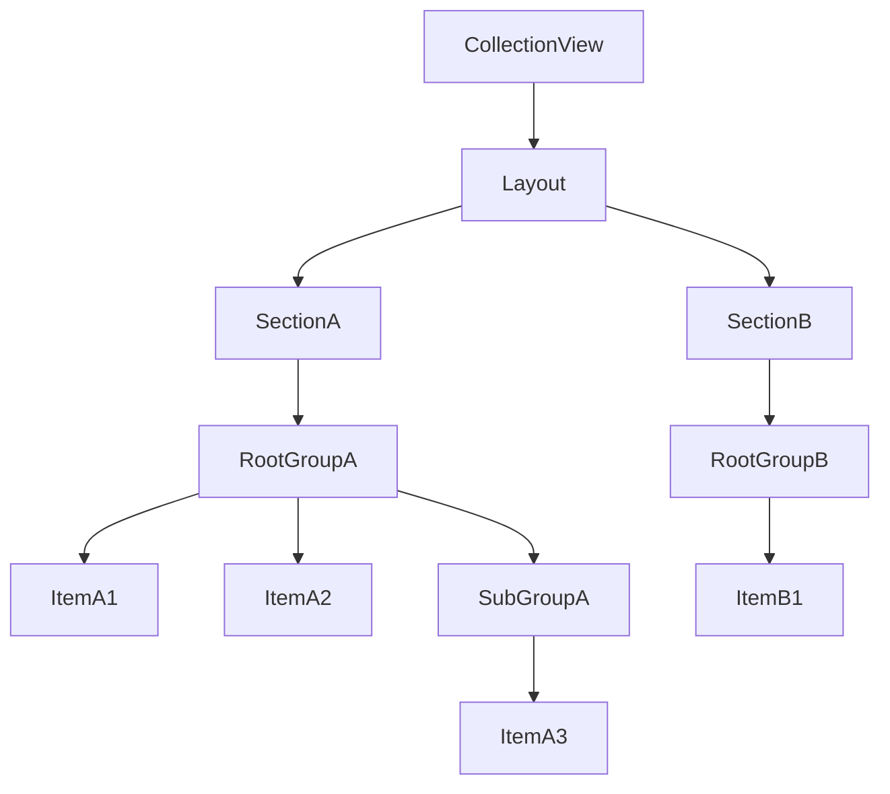

# UICollectionViewCompositionalLayout 使用教程（模块化 + 逐层组装）

> 本文以 `UICollectionViewCompositionalLayout` 为核心，按模块讲清 **size / inset / item / group / section / header / footer / background** 的配置项与作用，并最终把它们“一层层组装”成完整页面。  
> 仓库示例参考：`WyCompositionalLayoutController.m`（包含水平分页、网格、瀑布流 customGroup、header/footer、background decoration 等）。

## 目录

- [0. 最终我们要组装出什么](#0-最终我们要组装出什么)
- [1. Size 模块：NSCollectionLayoutSize / NSCollectionLayoutDimension](#1-size-模块nscollectionlayoutsize--nscollectionlayoutdimension)
- [2. Inset/Spacing 模块：contentInsets / interItemSpacing / interGroupSpacing / edgeSpacing](#2-insetspacing-模块contentinsets--interitemspacing--intergroupspacing--edgespacing)
- [3. Item 模块：NSCollectionLayoutItem](#3-item-模块nscollectionlayoutitem)
- [4. Group 模块：NSCollectionLayoutGroup（横向/纵向/自定义）](#4-group-模块nscollectionlayoutgroup横向纵向自定义)
- [5. Section 模块：NSCollectionLayoutSection（滚动、补充视图、背景、回调）](#5-section-模块nscollectionlayoutsection滚动补充视图背景回调)
- [6. Header/Footer 模块：Boundary Supplementary](#6-headerfooter-模块boundary-supplementary)
- [7. Background 模块：Decoration View](#7-background-模块decoration-view)
- [8. 逐层组装：从 Item→Group→Section→Layout→CollectionView](#8-逐层组装从-itemgroupsectionlayoutcollectionview)
- [9. 对照仓库示例：你该看哪些函数](#9-对照仓库示例你该看哪些函数)

---

## 0. 最终我们要组装出什么

`UICollectionViewCompositionalLayout` 的本质是：**Layout 由多个 Section 组成；每个 Section 由一个“根 Group”驱动；Group 里放 Item 或子 Group**。



记忆一句话：**Item 定“单元尺寸/边距”，Group 定“排列方式”，Section 定“行为/装饰/滚动”。**

---

## 1. Size 模块：NSCollectionLayoutSize / NSCollectionLayoutDimension

### 1.1 `NSCollectionLayoutSize` 是什么

`NSCollectionLayoutSize` 用来描述 **宽/高**，由两个 `NSCollectionLayoutDimension` 组成：

```objective-c
NSCollectionLayoutSize *size =
  [NSCollectionLayoutSize sizeWithWidthDimension:W heightDimension:H];
```

它会出现在 **Item、Group、Supplementary（header/footer）、Decoration（background）** 上。

### 1.2 `NSCollectionLayoutDimension` 四种常用维度

- **absolute**：绝对值（点数）
  - 适用：固定宽高卡片、固定高度 header
  - 例：`[NSCollectionLayoutDimension absoluteDimension:100]`
- **fractionalWidth / fractionalHeight**：相对于“容器”的比例
  - 注意：Item 的 fractional 参照的是 **所在 Group 的尺寸**
  - 例：三列网格 item 宽：`fractionalWidthDimension:1.0/3.0`
- **estimated**：估算值（系统可能根据内容二次计算）
  - 适用：自适应高度（文本多行、动态内容）
  - 风险：复杂布局中可能导致 **反复自适应（feedback loop）/ 抖动**
  - 经验：能算出明确高度就尽量别 estimated；瀑布流一般走 customGroup 自算 frame 更稳

### 1.3 你该怎么选（快速决策）

- **网格/横向卡片**：item 高度通常 `absolute`，宽度用 `fractionalWidth` 或 group 固定宽
- **自适应文字 cell**：item 高度 `estimated`，但要控制好约束/内容，避免回流
- **瀑布流**：优先 `customGroup`，在 itemProvider 里给出确定 frame

---

## 2. Inset/Spacing 模块：contentInsets / interItemSpacing / interGroupSpacing / edgeSpacing

### 2.1 先区分 4 种“空隙”来源

- **`contentInsets`**：内容内边距（Item、Group、Section 都能设置）
  - Item：等价于 cell 内容四周留白（影响 item 实际占位）
  - Group：group 内整体留白（影响 group 内 item 排列区域）
  - Section：section 在 collectionView 内容中的内边距
- **`interItemSpacing`**（Group 级）：同一个 group 内部“相邻 item”的间距
- **`interGroupSpacing`**（Section 级）：section 内部“相邻 group”的间距（例如行与行）
- **`edgeSpacing`**（Item 级）：更细粒度的 item 边缘间距（对齐/贴边控制）

### 2.2 常见搭配（建议）

- **三列网格**：
  - section `contentInsets` 控制左右边距
  - group `interItemSpacing` 控制列间距
  - section `interGroupSpacing` 控制行间距
- **横向分页卡片**：
  - section `contentInsets` 控制左右留白
  - section `interGroupSpacing` 控制卡片之间距离
- **瀑布流**：
  - 如果你在 frame 里自己把 inset/spacing 都算了，就不要再叠加 group/section 同样的 inset（避免“双重 inset”）

---

## 3. Item 模块：NSCollectionLayoutItem

### 3.1 Item 的作用

Item 描述“一个 cell 的几何规则”：**尺寸 +（可选）内边距/边缘间距**。

```objective-c
NSCollectionLayoutSize *itemSize =
  [NSCollectionLayoutSize sizeWithWidthDimension:[NSCollectionLayoutDimension fractionalWidthDimension:1.0]
                                 heightDimension:[NSCollectionLayoutDimension absoluteDimension:100]];

NSCollectionLayoutItem *item =
  [NSCollectionLayoutItem itemWithLayoutSize:itemSize];
```

### 3.2 Item 常用参数说明

- **`layoutSize`**：必须。决定 item 的宽高策略
- **`contentInsets`**：可选。给 item 内边距（常用于 cell 周围留白）
- **`edgeSpacing`**：可选。更精细地控制 item 与周边的“贴边距离”

示例（给 item 加内边距）：

```objective-c
item.contentInsets = NSDirectionalEdgeInsetsMake(0, 0, 0, 0);
```

---

## 4. Group 模块：NSCollectionLayoutGroup（横向/纵向/自定义）

Group 决定“怎么把 item 排成一组”。常见 3 类：

### 4.1 横向 Group（horizontal）

适用：一行多列网格、横向卡片列表（配合 section 正交滚动）。

```objective-c
NSCollectionLayoutGroup *group =
  [NSCollectionLayoutGroup horizontalGroupWithLayoutSize:groupSize
                                                 subitem:item
                                                   count:3];
```

常用参数：

- **`count`**：在该 group 内重复多少个 `subitem`
- **`interItemSpacing`**：列间距（同一行的 item 间距）
- **`contentInsets`**：group 内边距

### 4.2 纵向 Group（vertical）

适用：一列多行堆叠、或者作为“子 Group”再被横向 group 包裹（实现“横向分页的列”）。

```objective-c
NSCollectionLayoutGroup *group =
  [NSCollectionLayoutGroup verticalGroupWithLayoutSize:groupSize
                                               subitem:item
                                                 count:3];
```

### 4.3 自定义 Group（customGroup）

适用：瀑布流、杂志流、任何非规则位置布局。你需要在 `itemProvider` 里返回每个 item 的 frame。

```objective-c
NSCollectionLayoutGroup *group =
  [NSCollectionLayoutGroup customGroupWithLayoutSize:groupSize
                                       itemProvider:^NSArray<NSCollectionLayoutGroupCustomItem *> *(id<NSCollectionLayoutEnvironment> env) {
    // return custom frames...
  }];
```

---

## 5. Section 模块：NSCollectionLayoutSection（滚动、补充视图、背景、回调）

Section 负责把一个根 Group“放进 collectionView”，并定义这个 section 的行为与装饰。

```objective-c
NSCollectionLayoutSection *section =
  [NSCollectionLayoutSection sectionWithGroup:group];
```

### 5.1 Section 常用参数说明

- **`contentInsets`**：section 内边距（最常用）
- **`interGroupSpacing`**：group 与 group 的间距（行间距/卡片间距）
- **`orthogonalScrollingBehavior`**：正交滚动（让某个 section 横向滚动）
  - 常见：`GroupPaging`（分页）、`Continuous`（连续）、`None`
- **`boundarySupplementaryItems`**：section 的 header/footer
- **`decorationItems`**：section 的背景/装饰（对应 decoration view）
- **`visibleItemsInvalidationHandler`**：滚动时回调，可做视差、缩放、透明度等动效（高级但很实用）

---

## 6. Header/Footer 模块：Boundary Supplementary

Header/Footer 本质是 `NSCollectionLayoutBoundarySupplementaryItem`，它描述“补充视图的尺寸 + 位置 + 行为”。

### 6.1 如何创建 header / footer

```objective-c
NSCollectionLayoutSize *headerSize =
  [NSCollectionLayoutSize sizeWithWidthDimension:[NSCollectionLayoutDimension fractionalWidthDimension:1.0]
                                 heightDimension:[NSCollectionLayoutDimension absoluteDimension:40]];

NSCollectionLayoutBoundarySupplementaryItem *header =
  [NSCollectionLayoutBoundarySupplementaryItem boundarySupplementaryItemWithLayoutSize:headerSize
                                                                          elementKind:UICollectionElementKindSectionHeader
                                                                            alignment:NSRectAlignmentTop];
```

Footer 同理，只是 `elementKind` 和 `alignment` 不同：

```objective-c
NSCollectionLayoutBoundarySupplementaryItem *footer =
  [NSCollectionLayoutBoundarySupplementaryItem boundarySupplementaryItemWithLayoutSize:headerSize
                                                                          elementKind:UICollectionElementKindSectionFooter
                                                                            alignment:NSRectAlignmentBottom];
```

### 6.2 常用参数说明

- **`elementKind`**：必须。用于区分不同 supplementary 类型（注册/复用/提供 view 都靠它）
- **`alignment`**：必须。`Top/Bottom/Leading/Trailing` 等对齐方式
- **`pinToVisibleBounds`**：是否吸顶/吸底（sticky header）
- **`zIndex`**：层级（背景可用负值；需要压在 cell 下面）
- **`offset`**：微调位置（少用，但有时能救命）

### 6.3 你还需要做 2 件事：注册 + 提供 View

1）注册：

```objective-c
[collectionView registerClass:MyHeaderView.class
   forSupplementaryViewOfKind:UICollectionElementKindSectionHeader
          withReuseIdentifier:@"MyHeaderView"];
```

2）提供（DiffableDataSource 示例写法）：

```objective-c
dataSource.supplementaryViewProvider = ^UICollectionReusableView *(UICollectionView *cv, NSString *kind, NSIndexPath *ip) {
  return [cv dequeueReusableSupplementaryViewOfKind:kind withReuseIdentifier:@"MyHeaderView" forIndexPath:ip];
};
```

---

## 7. Background 模块：Decoration View

背景一般用 **Decoration View** 来做（它不是 supplementary，而是 layout 级别的“装饰视图”）。

### 7.1 注册 decoration view

```objective-c
[layout registerClass:MyBackgroundReusableView.class
forDecorationViewOfKind:@"background"];
```

### 7.2 给某个 section 加背景

```objective-c
NSCollectionLayoutDecorationItem *bg =
  [NSCollectionLayoutDecorationItem backgroundDecorationItemWithElementKind:@"background"];
bg.contentInsets = NSDirectionalEdgeInsetsMake(0, 16, 0, 16);
section.decorationItems = @[bg];
```

常用参数：

- **`elementKind`**：必须。与注册一致
- **`contentInsets`**：背景相对 section 内容的内缩/外扩（经常用来留圆角阴影空间）

---

## 8. 逐层组装：从 Item→Group→Section→Layout→CollectionView

下面给一个“最小但完整”的组装示例：页面有两个 section  
Section0：三列网格（带 header/footer + 背景）  
Section1：横向分页卡片（带 header + 背景）

> 代码是“可直接拷贝”的骨架，你只需要替换自己的 cell / header view / elementKind。

### 8.1 Step A：先定义 elementKind（建议统一管理）

```objective-c
static NSString * const MyDecorationBackgroundKind = @"background";
```

### 8.2 Step B：写两个 section builder（Item→Group→Section）

#### B1）网格 Section（3 列）

```objective-c
- (NSCollectionLayoutSection *)buildGridSection {
  NSCollectionLayoutSize *itemSize =
    [NSCollectionLayoutSize sizeWithWidthDimension:[NSCollectionLayoutDimension fractionalWidthDimension:1.0/3.0]
                                   heightDimension:[NSCollectionLayoutDimension absoluteDimension:100]];
  NSCollectionLayoutItem *item = [NSCollectionLayoutItem itemWithLayoutSize:itemSize];

  NSCollectionLayoutSize *groupSize =
    [NSCollectionLayoutSize sizeWithWidthDimension:[NSCollectionLayoutDimension fractionalWidthDimension:1.0]
                                   heightDimension:[NSCollectionLayoutDimension absoluteDimension:100]];
  NSCollectionLayoutGroup *group =
    [NSCollectionLayoutGroup horizontalGroupWithLayoutSize:groupSize subitem:item count:3];
  group.interItemSpacing = [NSCollectionLayoutSpacing fixedSpacing:10];

  NSCollectionLayoutSection *section = [NSCollectionLayoutSection sectionWithGroup:group];
  section.contentInsets = NSDirectionalEdgeInsetsMake(0, 16, 0, 16);
  section.interGroupSpacing = 10;

  // header/footer
  NSCollectionLayoutSize *hfSize =
    [NSCollectionLayoutSize sizeWithWidthDimension:[NSCollectionLayoutDimension fractionalWidthDimension:1.0]
                                   heightDimension:[NSCollectionLayoutDimension absoluteDimension:40]];
  NSCollectionLayoutBoundarySupplementaryItem *header =
    [NSCollectionLayoutBoundarySupplementaryItem boundarySupplementaryItemWithLayoutSize:hfSize
                                                                            elementKind:UICollectionElementKindSectionHeader
                                                                              alignment:NSRectAlignmentTop];
  NSCollectionLayoutBoundarySupplementaryItem *footer =
    [NSCollectionLayoutBoundarySupplementaryItem boundarySupplementaryItemWithLayoutSize:hfSize
                                                                            elementKind:UICollectionElementKindSectionFooter
                                                                              alignment:NSRectAlignmentBottom];
  section.boundarySupplementaryItems = @[header, footer];

  // background
  NSCollectionLayoutDecorationItem *bg =
    [NSCollectionLayoutDecorationItem backgroundDecorationItemWithElementKind:MyDecorationBackgroundKind];
  bg.contentInsets = NSDirectionalEdgeInsetsMake(0, 0, 0, 0);
  section.decorationItems = @[bg];

  return section;
}
```

#### B2）横向分页卡片 Section

```objective-c
- (NSCollectionLayoutSection *)buildPagingCardsSection {
  NSCollectionLayoutSize *itemSize =
    [NSCollectionLayoutSize sizeWithWidthDimension:[NSCollectionLayoutDimension fractionalWidthDimension:1.0]
                                   heightDimension:[NSCollectionLayoutDimension absoluteDimension:100]];
  NSCollectionLayoutItem *item = [NSCollectionLayoutItem itemWithLayoutSize:itemSize];

  NSCollectionLayoutSize *groupSize =
    [NSCollectionLayoutSize sizeWithWidthDimension:[NSCollectionLayoutDimension absoluteDimension:120]
                                   heightDimension:[NSCollectionLayoutDimension absoluteDimension:100]];
  NSCollectionLayoutGroup *group =
    [NSCollectionLayoutGroup horizontalGroupWithLayoutSize:groupSize subitem:item count:1];

  NSCollectionLayoutSection *section = [NSCollectionLayoutSection sectionWithGroup:group];
  section.orthogonalScrollingBehavior = UICollectionLayoutSectionOrthogonalScrollingBehaviorGroupPaging;
  section.contentInsets = NSDirectionalEdgeInsetsMake(0, 16, 0, 16);
  section.interGroupSpacing = 10;

  NSCollectionLayoutSize *headerSize =
    [NSCollectionLayoutSize sizeWithWidthDimension:[NSCollectionLayoutDimension fractionalWidthDimension:1.0]
                                   heightDimension:[NSCollectionLayoutDimension absoluteDimension:40]];
  NSCollectionLayoutBoundarySupplementaryItem *header =
    [NSCollectionLayoutBoundarySupplementaryItem boundarySupplementaryItemWithLayoutSize:headerSize
                                                                            elementKind:UICollectionElementKindSectionHeader
                                                                              alignment:NSRectAlignmentTop];
  section.boundarySupplementaryItems = @[header];

  NSCollectionLayoutDecorationItem *bg =
    [NSCollectionLayoutDecorationItem backgroundDecorationItemWithElementKind:MyDecorationBackgroundKind];
  section.decorationItems = @[bg];

  return section;
}
```

### 8.3 Step C：用 sectionProvider 组装 Layout（Section→Layout）

```objective-c
- (UICollectionViewCompositionalLayout *)buildLayout {
  __weak typeof(self) weakSelf = self;
  UICollectionViewCompositionalLayout *layout =
    [[UICollectionViewCompositionalLayout alloc] initWithSectionProvider:^NSCollectionLayoutSection *(NSInteger sectionIndex, id<NSCollectionLayoutEnvironment> env) {
      __strong typeof(weakSelf) self = weakSelf;
      if (!self) return nil;

      if (sectionIndex == 0) return [self buildGridSection];
      return [self buildPagingCardsSection];
    }];

  // 注册 background decoration
  [layout registerClass:MyBackgroundReusableView.class forDecorationViewOfKind:MyDecorationBackgroundKind];

  // 可选：layout 全局配置（section 之间的间距等）
  UICollectionViewCompositionalLayoutConfiguration *config = [UICollectionViewCompositionalLayoutConfiguration new];
  config.interSectionSpacing = 12;
  layout.configuration = config;

  return layout;
}
```

### 8.4 Step D：把 Layout 装到 CollectionView（Layout→CollectionView）

```objective-c
UICollectionView *cv =
  [[UICollectionView alloc] initWithFrame:CGRectZero collectionViewLayout:[self buildLayout]];
cv.backgroundColor = UIColor.clearColor;
```

到这里，一个完整页面的 compositional layout 就搭起来了：  
**Item → Group → Section → Layout → CollectionView**。

---

## 9. 对照仓库示例：你该看哪些函数

在 `WyCompositionalLayoutController.m` 中，你可以对照这些点去理解“模块如何落地到工程”：

- **Layout 组装（sectionProvider + configuration）**：`-generateLayout`
- **Item/Group/Section 常规搭建**：
  - `-sectionForRankArray`：典型的“Group 嵌套 + section 正交滚动”
  - `-sectionForVertical`：三列网格（fractionalWidth）
  - `-sectionForHorizontal`：横向分页卡片
- **瀑布流（customGroup）**：`-generateWaterfallSectionWithEnvironment:`
- **Header/Footer 提供与复用**：`supplementaryViewProvider`（DiffableDataSource）
- **Background decoration 注册**：`[layout registerClass:... forDecorationViewOfKind:]`

---

## 结语（建议你按这个顺序练习）

1. 先用 **网格 section** 把 `size + inset + spacing` 理顺  
2. 再加 **横向分页 section** 理解 `orthogonalScrollingBehavior`  
3. 最后挑战 **customGroup 瀑布流**（把 “尺寸计算” 从 AutoLayout/estimated 迁到你自己的 frame 计算）

