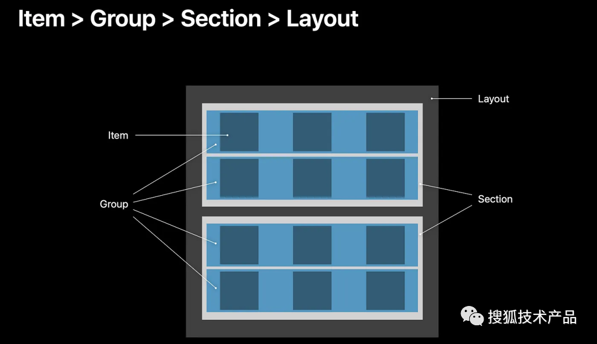

# UICollectionViewCompositionalLayout 使用教程

> 本教程基于 `WyCompositionalLayoutController.m` 示例代码，分步骤讲解 `UICollectionViewCompositionalLayout` 的核心概念和使用方法。

## 目录

- [1. 核心概念：Item、Group、Section 的关系](#1-核心概念itemgroupsection-的关系)
- [2. 第一步：创建 CompositionalLayout](#2-第一步创建-compositionallayout)
- [3. 第二步：构建 Section（从内到外）](#3-第二步构建-section从内到外)
  - [3.1 Rank Section：嵌套 Group + 正交滚动](#31-rank-section嵌套-group--正交滚动)
  - [3.2 Vertical Section：3 列网格布局](#32-vertical-section3-列网格布局)
  - [3.3 Horizontal Section：横向分页列表](#33-horizontal-section横向分页列表)
  - [3.4 Waterfall Section：瀑布流布局](#34-waterfall-section瀑布流布局)
- [4. 第三步：Header/Footer（Supplementary）的使用](#4-第三步headerfootersupplementary-的使用)
- [5. 嵌套 Group 的通用模板](#5-嵌套-group-的通用模板)
- [6. 实用技巧与注意事项](#6-实用技巧与注意事项)

---


## 1. 核心概念：Item、Group、Section 的关系

在 `UICollectionViewCompositionalLayout` 中，布局由三层结构组成：



### 1.1 三层结构

- **`NSCollectionLayoutItem`（Item）**  
  最小的布局单元，对应一个 cell。它定义了单个单元格的尺寸和边距。

- **`NSCollectionLayoutGroup`（Group）**  
  用来组织 Item 的容器，决定 Item 如何排列（横向、纵向或自定义位置）。  
  **关键点**：Group 可以包含 Item，也可以包含另一个 Group（这就是嵌套的核心）。

- **`NSCollectionLayoutSection`（Section）**  
  将某个 Group 作为 section 的内容，并在 section 级别控制：
  - 内容边距（`contentInsets`）
  - Group 之间的间距（`interGroupSpacing`）
  - 正交滚动行为（`orthogonalScrollingBehavior`）
  - Header/Footer（`boundarySupplementaryItems`）

### 1.2 关系图

```
Layout
  └── Section 1
      └── Group (根 Group)
          ├── Item 1
          ├── Item 2
          └── SubGroup (嵌套 Group)
              ├── Item 3
              └── Item 4
  └── Section 2
      └── Group
          └── Item 5
```

### 1.3 记忆口诀

**Item 定尺寸，Group 定排列，Section 定行为与装饰。**

---


## 2. 第一步：创建 CompositionalLayout

在 `WyCompositionalLayoutController` 中，通过 `sectionProvider` 动态返回不同 section 的布局：

```objc
- (UICollectionViewCompositionalLayout *)generateLayout {
    @weakify(self)
    UICollectionViewCompositionalLayout *layout = [[UICollectionViewCompositionalLayout alloc] initWithSectionProvider:^NSCollectionLayoutSection * _Nullable(NSInteger sectionIndex, id<NSCollectionLayoutEnvironment> _Nonnull layoutEnvironment) {
        @strongify(self)
        // 获取当前 section 的标识符
        NSString *sectionIdentifier = [self.dataSource snapshot].sectionIdentifiers[sectionIndex];
        // 根据标识判断Section的样式类型，然后根据类型，初始化不同的Section样式；
        if ([sectionIdentifier isEqualToString:kWyRankSection]) {
            return [self sectionForRankArray];
        } else if ([sectionIdentifier isEqualToString:kWyVerSection]) {
            return [self sectionForVertical];
        } else if ([sectionIdentifier isEqualToString:kWyHorSection]) {
            return [self sectionForHorizontal];
        } else if ([sectionIdentifier isEqualToString:kWyWaterfallSection]) {
            return [self generateWaterfallSectionWithEnvironment:layoutEnvironment];
        }
        return nil;
    }];
    
    // 注册背景的样式
    [layout registerClass:WyBackgroundReusableView.class forDecorationViewOfKind:@"background"];
    
    // 初始化layout的Header
    NSCollectionLayoutSize *headerSize = [NSCollectionLayoutSize sizeWithWidthDimension:[NSCollectionLayoutDimension fractionalWidthDimension:1.0] heightDimension:[NSCollectionLayoutDimension absoluteDimension:kVEarnRewardV21HeaderHeight]];
    NSCollectionLayoutBoundarySupplementaryItem *header = [NSCollectionLayoutBoundarySupplementaryItem boundarySupplementaryItemWithLayoutSize:headerSize elementKind:kVEarnRewardV21ElementKindHeader alignment:NSRectAlignmentTop];
    header.pinToVisibleBounds = NO;
    header.zIndex = -1;
    
    // 初始化layout的Footer
    NSCollectionLayoutSize *footerSize = [NSCollectionLayoutSize sizeWithWidthDimension:[NSCollectionLayoutDimension fractionalWidthDimension:1.0] heightDimension:[NSCollectionLayoutDimension absoluteDimension:kVEarnRewardV21FooterHeight]];
    NSCollectionLayoutBoundarySupplementaryItem *footer = [NSCollectionLayoutBoundarySupplementaryItem boundarySupplementaryItemWithLayoutSize:footerSize elementKind:kVEarnRewardV21ElementKindFooter alignment:NSRectAlignmentBottom];
    footer.pinToVisibleBounds = NO;
    footer.zIndex = -1;
    
    UICollectionViewCompositionalLayoutConfiguration *config = UICollectionViewCompositionalLayoutConfiguration.new;
    // Section与Section之间的间距
    config.interSectionSpacing = (12);
    // layout整组的header与footer
    config.boundarySupplementaryItems = @[header, footer];
    
    layout.configuration = config;
    
    return layout;
}
```

### 关键点

1. **`sectionProvider`**：根据 `sectionIndex` 返回对应的 `NSCollectionLayoutSection`，实现一个页面混合多种布局。
2. **`layoutEnvironment`**：提供容器信息（如可用宽度），在瀑布流等需要精确计算的场景中非常有用。

### Layout 全局配置

```objective-c
UICollectionViewCompositionalLayoutConfiguration *config = UICollectionViewCompositionalLayoutConfiguration.new;
config.interSectionSpacing = (12);
config.boundarySupplementaryItems = @[header, footer];

layout.configuration = config;
```

- **`interSectionSpacing`**：控制不同 section 之间的间距
- **`boundarySupplementaryItems`**：设置全局的 header/footer（区别于 section 自己的 header/footer）

---


## 3. 第二步：构建 Section（从内到外）

构建 section 的标准流程：

1. **定义 Item 的尺寸**
2. **定义 Group（横向/纵向/嵌套/自定义）**
3. **将 Group 放入 Section，并设置 section 行为**

下面逐个分析示例中的四种 section。

---

### 3.1 Rank Section：嵌套 Group + 正交滚动

这个 section 实现了**横向滚动的列，每列包含 3 个竖向堆叠的 item**。

#### 代码实现

```objc
// 1. 创建单元格的布局项 (Item)
NSCollectionLayoutItem *item = [NSCollectionLayoutItem itemWithLayoutSize:
                                    [NSCollectionLayoutSize sizeWithWidthDimension:[NSCollectionLayoutDimension absoluteDimension:213]
                                                                   heightDimension:[NSCollectionLayoutDimension absoluteDimension:100]]];  // 设定单元格的高度为 100
```

```objc
// 2. 创建竖向排列的 Group，每列最多 3 行
NSCollectionLayoutGroup *verticalGroup = [NSCollectionLayoutGroup verticalGroupWithLayoutSize:[NSCollectionLayoutSize                                       sizeWithWidthDimension:[NSCollectionLayoutDimension absoluteDimension:213]
heightDimension:[NSCollectionLayoutDimension absoluteDimension:307]]
subitem:item count:3];
// 上下cell间距
verticalGroup.interItemSpacing = [NSCollectionLayoutSpacing fixedSpacing:3.5];
```

```objc
    // 3. 创建 Section
    NSCollectionLayoutSection *section = [NSCollectionLayoutSection sectionWithGroup:verticalGroup];
    section.orthogonalScrollingBehavior = UICollectionLayoutSectionOrthogonalScrollingBehaviorGroupPaging;  // 按Group分页
    // Section内部inset
    section.contentInsets = NSDirectionalEdgeInsetsMake(0, 16, 0, 16);
    // Group与Group之间的间距
    section.interGroupSpacing = 10;
```


#### 嵌套关系解析

1. **Item**：单个卡片，尺寸 `213×100`
2. **verticalGroup**：竖向 Group，包含 3 个 item（`count:3`），高度 `307`（3×100 + 2×3.5 间距）
4. **Section**：以**verticalGroup**样式，生成Section；设置 `orthogonalScrollingBehavior = GroupPaging`，实现该 section 的横向分页滚动

#### 视觉效果

```
┌─────────────────────────────────────────┐
│  Section Header                         │
├─────────────────────────────────────────┤
│  ┌─────┐  ┌─────┐  ┌─────┐  ┌─────┐   	│
│  │Item1│  │Item1│  │Item1│  │Item1│   	│
│  ├─────┤  ├─────┤  ├─────┤  ├─────┤   	│
│  │Item2│  │Item2│  │Item2│  │Item2│   	│
│  ├─────┤  ├─────┤  ├─────┤  ├─────┤   	│
│  │Item3│  │Item3│  │Item3│  │Item3│   	│
│  └─────┘  └─────┘  └─────┘  └─────┘   	│
│   ←──────── 横向滚动（分页）────────→			 │
├─────────────────────────────────────────┤
│  Section Footer                         │
└─────────────────────────────────────────┘
```

#### 关键 API

- **`verticalGroupWithLayoutSize:subitem:count:`**：创建竖向 Group，`count` 指定包含多少个 subitem
- **`horizontalGroupWithLayoutSize:subitem:count:`**：创建横向 Group
- **`orthogonalScrollingBehavior`**：设置正交滚动行为
  - `GroupPaging`：按 Group 分页滚动
  - `Continuous`：连续滚动
  - `None`：不滚动（默认）

---

### 3.2 Vertical Section：3 列网格布局

这个 section 实现了常见的**3 列网格布局**。

#### 代码实现

```objc
    // 1. 创建单元格的布局项 (Item)
    NSCollectionLayoutItem *item = [NSCollectionLayoutItem itemWithLayoutSize:
                                    [NSCollectionLayoutSize sizeWithWidthDimension:[NSCollectionLayoutDimension fractionalWidthDimension:0.33]
                                                                   heightDimension:[NSCollectionLayoutDimension estimatedDimension:100]]];  // 设定单元格的高度为 100

    // 2. 创建水平Group，每行限制3个；
    NSCollectionLayoutGroup *horizontalGroup = [NSCollectionLayoutGroup horizontalGroupWithLayoutSize:
                                              [NSCollectionLayoutSize sizeWithWidthDimension:[NSCollectionLayoutDimension fractionalWidthDimension:1.0]
                                                                             heightDimension:[NSCollectionLayoutDimension absoluteDimension:100]]
                                                                                          subitem:item count:3];
    // cell间距
    horizontalGroup.interItemSpacing = [NSCollectionLayoutSpacing fixedSpacing:10];
    
    // group的inset
    horizontalGroup.contentInsets = NSDirectionalEdgeInsetsMake(0, 16, 0, 16);
    

                                                                                              
    // 3. 创建 Section
    NSCollectionLayoutSection *section = [NSCollectionLayoutSection sectionWithGroup:horizontalGroup];
//    section.orthogonalScrollingBehavior = UICollectionLayoutSectionOrthogonalScrollingBehaviorGroupPaging;  // 使其支持水平滚动
//    section.contentInsets = NSDirectionalEdgeInsetsMake(0, 16, 0, 16);
    section.interGroupSpacing = 10;
```

#### 布局解析

1. **Item**：宽度为 Group 的 `33%`（`fractionalWidthDimension:0.33`），高度 `estimatedDimension:100`
2. **horizontalGroup**：横向 Group，包含 3 个 item（`count:3`），形成一行 3 列
3. **verticalGroup**：竖向 Group，将 `horizontalGroup` 作为 subitem（`count:1` 表示每组只有一行）
4. **Section**：未开启正交滚动，正常竖向滚动

#### 关键概念

- **`fractionalWidthDimension:0.33`**：Item 宽度占 Group 宽度的 1/3，3 个 item 正好铺满一行
- **`interItemSpacing`**：控制 Group 内部 Item 之间的间距（这里是同一行内 3 个 item 的间距）
- **`interGroupSpacing`**：控制 Group 之间的间距（这里是行与行之间的间距）

#### 视觉效果

```
┌─────────────────────────────────────────┐
│  Section Header                         │
├─────────────────────────────────────────┤
│  ┌────┐  ┌────┐  ┌────┐                │
│  │Item│  │Item│  │Item│                │
│  └────┘  └────┘  └────┘                │
│  ┌────┐  ┌────┐  ┌────┐                │
│  │Item│  │Item│  │Item│                │
│  └────┘  └────┘  └────┘                │
│  ┌────┐  ┌────┐  ┌────┐                │
│  │Item│  │Item│  │Item│                │
│  └────┘  └────┘  └────┘                │
│         ↓ 竖向滚动                      │
├─────────────────────────────────────────┤
│  Section Footer                         │
└─────────────────────────────────────────┘
```

---

### 3.3 Horizontal Section：横向分页列表

这个 section 实现了**固定宽度的横向分页滚动列表**。

#### 代码实现

```204:231:WyHelperComponents/Classes/UICollectionViewDemo/WyCompositionalLayoutController.m
- (NSCollectionLayoutSection *)sectionForHorizontal {
    // 1. 创建单元格的布局项 (Item)
    NSCollectionLayoutItem *item = [NSCollectionLayoutItem itemWithLayoutSize:
                                    [NSCollectionLayoutSize sizeWithWidthDimension:[NSCollectionLayoutDimension fractionalWidthDimension:1.0]
                                                                   heightDimension:[NSCollectionLayoutDimension estimatedDimension:100]]];  // 设定单元格的高度为 100
    
    // 2. 创建水平滚动的 Group，每一行包含多个竖向排列的列
    NSCollectionLayoutGroup *horizontalGroup = [NSCollectionLayoutGroup horizontalGroupWithLayoutSize:
                                                [NSCollectionLayoutSize sizeWithWidthDimension:[NSCollectionLayoutDimension absoluteDimension:98]
                                                                               heightDimension:[NSCollectionLayoutDimension estimatedDimension:100]]
                                                                                              subitem:item count:1];
    // 3. 创建 Section
    NSCollectionLayoutSection *section = [NSCollectionLayoutSection sectionWithGroup:horizontalGroup];
    section.orthogonalScrollingBehavior = UICollectionLayoutSectionOrthogonalScrollingBehaviorGroupPaging;  // 使其支持水平滚动
    section.contentInsets = NSDirectionalEdgeInsetsMake(0, 16, 0, 16);
    section.interGroupSpacing = 10;
    
    // 3.1 section header
    NSCollectionLayoutSize *headerSize = [NSCollectionLayoutSize sizeWithWidthDimension:[NSCollectionLayoutDimension fractionalWidthDimension:1.0] heightDimension:[NSCollectionLayoutDimension absoluteDimension:40]];
    NSCollectionLayoutBoundarySupplementaryItem *header = [NSCollectionLayoutBoundarySupplementaryItem boundarySupplementaryItemWithLayoutSize:headerSize elementKind:UICollectionElementKindSectionHeader alignment:NSRectAlignmentTop];
    header.pinToVisibleBounds = NO;
    
    NSCollectionLayoutBoundarySupplementaryItem *footer = [NSCollectionLayoutBoundarySupplementaryItem boundarySupplementaryItemWithLayoutSize:headerSize elementKind:UICollectionElementKindSectionFooter alignment:NSRectAlignmentBottom];
    footer.pinToVisibleBounds = NO;
    section.boundarySupplementaryItems = @[header, footer];
    
    return section;
}
```

#### 布局解析

1. **Item**：宽度占 Group 的 100%（`fractionalWidthDimension:1.0`），高度 `estimatedDimension:100`
2. **horizontalGroup**：横向 Group，固定宽度 `98`，包含 1 个 item
3. **Section**：开启 `orthogonalScrollingBehavior = GroupPaging`，实现横向分页滚动

#### 视觉效果

```
┌─────────────────────────────────────────┐
│  Section Header                         │
├─────────────────────────────────────────┤
│  ┌────┐  ┌────┐  ┌────┐  ┌────┐       │
│  │Item│  │Item│  │Item│  │Item│       │
│  └────┘  └────┘  └────┘  └────┘       │
│   ←──────── 横向分页滚动 ────────→      │
├─────────────────────────────────────────┤
│  Section Footer                         │
└─────────────────────────────────────────┘
```

---

### 3.4 Waterfall Section：瀑布流布局

瀑布流布局需要**自定义每个 item 的位置**，使用 `customGroupWithLayoutSize:itemProvider:` 实现。

#### 代码实现

```233:292:WyHelperComponents/Classes/UICollectionViewDemo/WyCompositionalLayoutController.m
- (NSCollectionLayoutSection *)generateWaterfallSectionWithEnvironment:(id<NSCollectionLayoutEnvironment>)environment {
    // Swift 对齐：edgeInsets = (top:0, leading:20, bottom:0, trailing:20)
    NSDirectionalEdgeInsets edgeInsets = NSDirectionalEdgeInsetsMake(0, 20, 0, 20);

    // Swift 对齐：2 列、间距 10
    NSInteger numberOfColumns = 2;
    CGFloat space = 10.0;

    // 注意：frames 里已经包含了 edgeInsets，因此 itemWidth 必须从可用宽度中扣掉 leading/trailing；
    // 同时不要再给 group 额外设置 contentInsets（否则会"双重 inset"，很容易触发 compositional self-sizing 反馈环）。
    CGFloat contentWidth = environment.container.effectiveContentSize.width;
    CGFloat availableWidth = contentWidth - edgeInsets.leading - edgeInsets.trailing;
    CGFloat itemWidth = (availableWidth - (CGFloat)(numberOfColumns - 1) * space) / (CGFloat)numberOfColumns;

    // 预计算 frames 与总高度，避免 OC 下 estimated height 触发反复布局的问题
    NSMutableArray<NSNumber *> *columnHeights = [NSMutableArray arrayWithCapacity:numberOfColumns];
    for (NSInteger i = 0; i < numberOfColumns; i++) {
        [columnHeights addObject:@(edgeInsets.top)];
    }

    NSMutableArray<NSValue *> *frames = [NSMutableArray arrayWithCapacity:self.items.count];
    CGFloat maxHeight = 0;

    for (NSInteger i = 0; i < self.items.count; i++) {
        NSInteger targetColumn = 0;
        for (NSInteger c = 0; c < numberOfColumns; c++) {
            if (columnHeights[c].doubleValue < columnHeights[targetColumn].doubleValue) {
                targetColumn = c;
            }
        }

        WaterfallItemModel *model = [self.items objectAtIndex:i];
        CGFloat itemHeight = model.height;

        CGFloat x = edgeInsets.leading + (itemWidth + space) * (CGFloat)targetColumn;
        CGFloat y = columnHeights[targetColumn].doubleValue;
        CGFloat spacingY = (y == edgeInsets.top) ? 0 : space;

        CGRect frame = CGRectMake(x, y + spacingY, itemWidth, itemHeight);
        [frames addObject:[NSValue valueWithCGRect:frame]];

        CGFloat newHeight = y + spacingY + itemHeight;
        columnHeights[targetColumn] = @(newHeight);
        maxHeight = MAX(maxHeight, newHeight);
    }

    NSCollectionLayoutSize *groupSize = [NSCollectionLayoutSize sizeWithWidthDimension:[NSCollectionLayoutDimension fractionalWidthDimension:1.0]
                                                                       heightDimension:[NSCollectionLayoutDimension estimatedDimension:100]];

    NSCollectionLayoutGroup *group = [NSCollectionLayoutGroup customGroupWithLayoutSize:groupSize
                                                                          itemProvider:^NSArray<NSCollectionLayoutGroupCustomItem *> * _Nonnull(id<NSCollectionLayoutEnvironment>  _Nonnull layoutEnvironment) {
        NSMutableArray<NSCollectionLayoutGroupCustomItem *> *items = [NSMutableArray arrayWithCapacity:frames.count];
        for (NSValue *value in frames) {
            [items addObject:[NSCollectionLayoutGroupCustomItem customItemWithFrame:value.CGRectValue]];
        }
        return items;
    }];

    return [NSCollectionLayoutSection sectionWithGroup:group];
}
```

#### 布局解析

1. **计算可用宽度**：从 `environment.container.effectiveContentSize.width` 获取容器宽度，减去边距
2. **计算 item 宽度**：`(可用宽度 - (列数-1) × 间距) / 列数`
3. **瀑布流算法**：
   - 维护每列的高度数组 `columnHeights`
   - 每次选择最短的列放置 item
   - 计算 item 的 frame 并保存
4. **创建 Custom Group**：使用 `customGroupWithLayoutSize:itemProvider:` 返回自定义的 item frames

#### 关键 API

- **`environment.container.effectiveContentSize`**：获取容器的有效内容尺寸
- **`customGroupWithLayoutSize:itemProvider:`**：创建自定义 Group，通过 `itemProvider` 返回每个 item 的 frame
- **`NSCollectionLayoutGroupCustomItem`**：自定义 item 的 frame

#### 视觉效果

```
┌─────────────────────────────────────────┐
│  ┌────┐      ┌────┐                    │
│  │Item│      │Item│                    │
│  │ 1  │      │ 2  │                    │
│  └────┘      └────┘                    │
│  ┌────┐      ┌────┐                    │
│  │Item│      │Item│                    │
│  │ 3  │      │ 4  │                    │
│  └────┘      │    │                    │
│  ┌────┐      │    │                    │
│  │Item│      └────┘                    │
│  │ 5  │      ┌────┐                    │
│  └────┘      │Item│                    │
│              │ 6  │                    │
│              └────┘                    │
│         ↓ 竖向滚动                     │
└─────────────────────────────────────────┘
```

---

## 4. 第三步：Header/Footer（Supplementary）的使用

`UICollectionViewCompositionalLayout` 支持两种层级的 Header/Footer：

### 4.1 Section 级别的 Header/Footer

每个 section 可以有自己的 header 和 footer，通过 `section.boundarySupplementaryItems` 设置：

```152:160:WyHelperComponents/Classes/UICollectionViewDemo/WyCompositionalLayoutController.m
NSCollectionLayoutSize *headerSize = [NSCollectionLayoutSize sizeWithWidthDimension:[NSCollectionLayoutDimension fractionalWidthDimension:1.0] heightDimension:[NSCollectionLayoutDimension absoluteDimension:40]];
NSCollectionLayoutBoundarySupplementaryItem *header = [NSCollectionLayoutBoundarySupplementaryItem boundarySupplementaryItemWithLayoutSize:headerSize elementKind:UICollectionElementKindSectionHeader alignment:NSRectAlignmentTop];
header.pinToVisibleBounds = NO;

NSCollectionLayoutBoundarySupplementaryItem *footer = [NSCollectionLayoutBoundarySupplementaryItem boundarySupplementaryItemWithLayoutSize:headerSize elementKind:UICollectionElementKindSectionFooter alignment:NSRectAlignmentBottom];
footer.pinToVisibleBounds = NO;
section.boundarySupplementaryItems = @[header, footer];
```

### 4.2 Layout 级别的 Header/Footer

整个 collectionView 可以有全局的 header 和 footer，通过 `layout.configuration.boundarySupplementaryItems` 设置：

```402:416:WyHelperComponents/Classes/UICollectionViewDemo/WyCompositionalLayoutController.m
NSCollectionLayoutSize *headerSize = [NSCollectionLayoutSize sizeWithWidthDimension:[NSCollectionLayoutDimension fractionalWidthDimension:1.0] heightDimension:[NSCollectionLayoutDimension absoluteDimension:kVEarnRewardV21HeaderHeight]];
NSCollectionLayoutBoundarySupplementaryItem *header = [NSCollectionLayoutBoundarySupplementaryItem boundarySupplementaryItemWithLayoutSize:headerSize elementKind:kVEarnRewardV21ElementKindHeader alignment:NSRectAlignmentTop];
header.pinToVisibleBounds = NO;
header.zIndex = -1;

NSCollectionLayoutSize *footerSize = [NSCollectionLayoutSize sizeWithWidthDimension:[NSCollectionLayoutDimension fractionalWidthDimension:1.0] heightDimension:[NSCollectionLayoutDimension absoluteDimension:kVEarnRewardV21FooterHeight]];
NSCollectionLayoutBoundarySupplementaryItem *footer = [NSCollectionLayoutBoundarySupplementaryItem boundarySupplementaryItemWithLayoutSize:footerSize elementKind:kVEarnRewardV21ElementKindFooter alignment:NSRectAlignmentBottom];
footer.pinToVisibleBounds = NO;
footer.zIndex = -1;

UICollectionViewCompositionalLayoutConfiguration *config = UICollectionViewCompositionalLayoutConfiguration.new;
config.interSectionSpacing = (12);
config.boundarySupplementaryItems = @[header, footer];

layout.configuration = config;
```

### 4.3 提供 Supplementary View

通过 `supplementaryViewProvider` 根据 `elementKind` 提供对应的视图：

```296:327:WyHelperComponents/Classes/UICollectionViewDemo/WyCompositionalLayoutController.m
[self.dataSource setSupplementaryViewProvider:^UICollectionReusableView * _Nullable(UICollectionView * _Nonnull collectionView, NSString * _Nonnull elementKind, NSIndexPath * _Nonnull indexPath) {
    @strongify(self)
    if ([elementKind isEqualToString:UICollectionElementKindSectionHeader]) {
        WyCollectionReusableView *header = [collectionView dequeueReusableSupplementaryViewOfKind:elementKind withReuseIdentifier:NSStringFromClass([WyCollectionReusableView class]) forIndexPath:indexPath];
        NSString *sectionIdentify = [self.dataSnapshot.sectionIdentifiers objectAtIndex:indexPath.section];
        if (sectionIdentify) {
            header.titleLabel.text = [NSString stringWithFormat:@"%@-Header", sectionIdentify];
        }
        return header;
    } else if ([elementKind isEqualToString:UICollectionElementKindSectionFooter]) {
        WyCollectionReusableView *header = [collectionView dequeueReusableSupplementaryViewOfKind:elementKind withReuseIdentifier:NSStringFromClass([WyCollectionReusableView class]) forIndexPath:indexPath];
        NSString *sectionIdentify = [self.dataSnapshot.sectionIdentifiers objectAtIndex:indexPath.section];
        if (sectionIdentify) {
            header.titleLabel.text = [NSString stringWithFormat:@"%@-Footer", sectionIdentify];
        }
        return header;
    } else if ([elementKind isEqualToString:kVEarnRewardV21ElementKindHeader]) {
        WyCollectionReusableView *header = [collectionView dequeueReusableSupplementaryViewOfKind:elementKind withReuseIdentifier:NSStringFromClass([WyCollectionReusableView class]) forIndexPath:indexPath];
        header.titleLabel.text = @"CollectionView-Header";
        return header;
    } else if ([elementKind isEqualToString:kVEarnRewardV21ElementKindFooter]) {
        WyCollectionReusableView *header = [collectionView dequeueReusableSupplementaryViewOfKind:elementKind withReuseIdentifier:NSStringFromClass([WyCollectionReusableView class]) forIndexPath:indexPath];
        header.titleLabel.text = @"CollectionView-Footer";
        return header;
    }
    return nil;
}];
```

### 4.4 注册 Supplementary View

在使用前需要注册对应的 Supplementary View：

```424:427:WyHelperComponents/Classes/UICollectionViewDemo/WyCompositionalLayoutController.m
[_listView registerClass:WyCollectionReusableView.class forSupplementaryViewOfKind:UICollectionElementKindSectionHeader withReuseIdentifier:NSStringFromClass([WyCollectionReusableView class])];
[_listView registerClass:WyCollectionReusableView.class forSupplementaryViewOfKind:UICollectionElementKindSectionFooter withReuseIdentifier:NSStringFromClass([WyCollectionReusableView class])];
[_listView registerClass:WyCollectionReusableView.class forSupplementaryViewOfKind:kVEarnRewardV21ElementKindHeader withReuseIdentifier:NSStringFromClass([WyCollectionReusableView class])];
[_listView registerClass:WyCollectionReusableView.class forSupplementaryViewOfKind:kVEarnRewardV21ElementKindFooter withReuseIdentifier:NSStringFromClass([WyCollectionReusableView class])];
```

---

## 5. 嵌套 Group 的通用模板

当需要实现复杂的嵌套布局时，可以按照以下模板思考：

### 5.1 思考步骤

1. **确定最小单元（Item）**：定义单个 cell 的尺寸
2. **创建子 Group**：将 Item 组织成可复用的局部结构（如一行、一列）
3. **创建外层 Group**：将子 Group 按另一个方向排列
4. **创建 Section**：将根 Group 放入 Section，设置 section 行为

### 5.2 示例：Rank Section 的嵌套结构

```
Item (213×100)
  ↓
verticalGroup (213×307, 包含 3 个 Item)
  ↓
horizontalGroup (213×330, 包含 1 个 verticalGroup)
  ↓
Section (开启正交滚动)
```

### 5.3 常见嵌套模式

- **横向列表中的竖向堆叠**：`Item → verticalGroup → horizontalGroup → Section`
- **网格布局**：`Item → horizontalGroup → verticalGroup → Section`
- **多级嵌套**：`Item → subGroup1 → subGroup2 → rootGroup → Section`

---

## 6. 实用技巧与注意事项

### 6.1 尺寸类型的选择

- **`absoluteDimension`**：固定尺寸，适用于已知大小的 item
- **`fractionalWidthDimension` / `fractionalHeightDimension`**：相对尺寸，相对于 Group 的百分比
- **`estimatedDimension`**：估算尺寸，系统会根据内容自动调整，但可能触发布局反馈环

### 6.2 避免布局反馈环

在瀑布流示例中，代码注释特别强调了：

```241:242:WyHelperComponents/Classes/UICollectionViewDemo/WyCompositionalLayoutController.m
    // 注意：frames 里已经包含了 edgeInsets，因此 itemWidth 必须从可用宽度中扣掉 leading/trailing；
    // 同时不要再给 group 额外设置 contentInsets（否则会"双重 inset"，很容易触发 compositional self-sizing 反馈环）。
```

**建议**：
- 瀑布流等需要精确计算的布局，尽量预计算 frame，避免使用 `estimatedDimension`
- 避免重复设置 insets（在 frame 计算中已包含的，不要再在 group/section 中设置）

### 6.3 何时使用 Custom Group

- **规则布局**：使用 `horizontalGroup`、`verticalGroup` 等标准 Group
- **不规则布局**：使用 `customGroupWithLayoutSize:itemProvider:` 自定义每个 item 的位置
  - 瀑布流
  - 杂志流
  - 任意自定义排列

### 6.4 正交滚动的使用场景

- **横向 Banner**：`horizontalGroup` + `orthogonalScrollingBehavior = GroupPaging`
- **卡片堆叠**：`verticalGroup` 嵌套到 `horizontalGroup` + 正交滚动
- **注意**：正交滚动只影响该 section，不影响整个 collectionView 的滚动方向

### 6.5 性能优化建议

1. **预计算尺寸**：对于瀑布流等复杂布局，提前计算好所有 item 的 frame
2. **合理使用 estimatedDimension**：在简单布局中使用，复杂布局中避免
3. **复用 Supplementary View**：确保正确注册和复用 header/footer

---

## 总结

`UICollectionViewCompositionalLayout` 通过 **Item → Group → Section** 的三层结构，提供了强大的布局能力：

- **Item**：定义单个 cell 的尺寸
- **Group**：组织 Item 的排列方式，支持嵌套
- **Section**：控制布局行为和装饰（滚动、间距、header/footer）

通过组合使用标准 Group 和 Custom Group，可以实现从简单的网格布局到复杂的瀑布流、杂志流等各种布局效果。

---

## 参考

- 示例代码：[`WyCompositionalLayoutController.m`](WyCompositionalLayoutController.m)
- Apple 官方文档：[UICollectionViewCompositionalLayout](https://developer.apple.com/documentation/uikit/views_and_controls/collection_views/layouts/customizing_collection_view_layouts)

